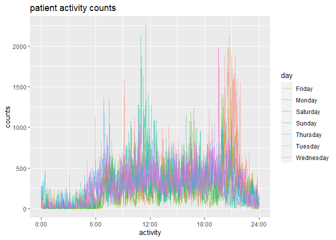
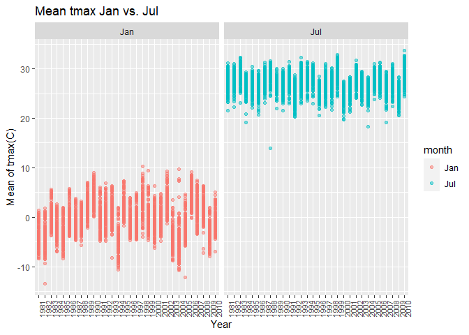
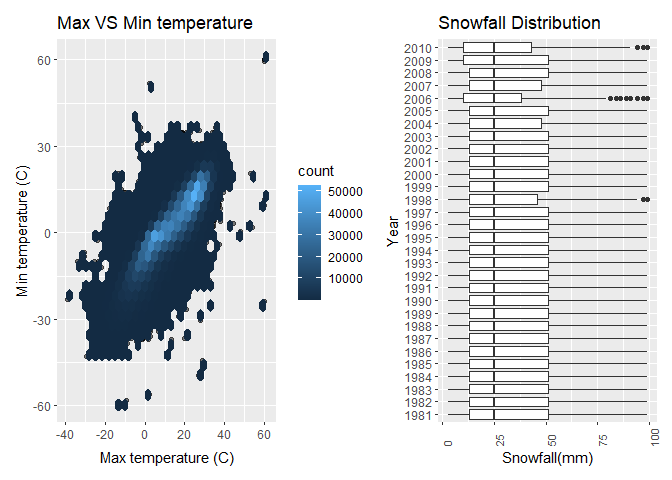

p8105_hw3_wm2473
================
2022-10-11

# Problem 1

``` r
library(p8105.datasets)
library(tidyverse)
```

    ## ── Attaching packages ─────────────────────────────────────── tidyverse 1.3.2 ──
    ## ✔ ggplot2 3.3.6      ✔ purrr   0.3.4 
    ## ✔ tibble  3.1.8      ✔ dplyr   1.0.10
    ## ✔ tidyr   1.2.0      ✔ stringr 1.4.1 
    ## ✔ readr   2.1.2      ✔ forcats 0.5.2 
    ## ── Conflicts ────────────────────────────────────────── tidyverse_conflicts() ──
    ## ✖ dplyr::filter() masks stats::filter()
    ## ✖ dplyr::lag()    masks stats::lag()

``` r
library(readxl)

data("instacart")
```

# Sum of aisles

``` r
instacart %>% 
  count(aisle) %>%  
  arrange(desc(n))
```

    ## # A tibble: 134 × 2
    ##    aisle                              n
    ##    <chr>                          <int>
    ##  1 fresh vegetables              150609
    ##  2 fresh fruits                  150473
    ##  3 packaged vegetables fruits     78493
    ##  4 yogurt                         55240
    ##  5 packaged cheese                41699
    ##  6 water seltzer sparkling water  36617
    ##  7 milk                           32644
    ##  8 chips pretzels                 31269
    ##  9 soy lactosefree                26240
    ## 10 bread                          23635
    ## # … with 124 more rows

``` r
# Answer: In total, there are 134 aisle. And fresh vegetables and fresh fruits holding the most items ordered by far.
```

\#Make a plot shows the number of items ordered

``` r
instacart %>% 
  count(aisle) %>% 
  filter(n > 10000) %>% 
  mutate(aisle = fct_reorder(aisle, n)) %>% 
  ggplot(aes(x = aisle, y = n)) + 
  geom_point() + 
  labs(title = "Number of items ordered in each aisle") +
  theme(axis.text.x = element_text(angle = 60, hjust = 1))
```

<!-- -->

# Make a table showing three most popular items in aisles

``` r
instacart %>% 
  filter(aisle %in% c("baking ingredients", "dog food care", "packaged vegetables fruits")) %>% 
  group_by(aisle) %>% 
  count(product_name) %>% 
  mutate(rank = min_rank(desc(n))) %>% 
  filter(rank < 4) %>% 
  arrange(desc(n)) %>%
  knitr::kable()
```

| aisle                      | product_name                                  |    n | rank |
|:---------------------------|:----------------------------------------------|-----:|-----:|
| packaged vegetables fruits | Organic Baby Spinach                          | 9784 |    1 |
| packaged vegetables fruits | Organic Raspberries                           | 5546 |    2 |
| packaged vegetables fruits | Organic Blueberries                           | 4966 |    3 |
| baking ingredients         | Light Brown Sugar                             |  499 |    1 |
| baking ingredients         | Pure Baking Soda                              |  387 |    2 |
| baking ingredients         | Cane Sugar                                    |  336 |    3 |
| dog food care              | Snack Sticks Chicken & Rice Recipe Dog Treats |   30 |    1 |
| dog food care              | Organix Chicken & Brown Rice Recipe           |   28 |    2 |
| dog food care              | Small Dog Biscuits                            |   26 |    3 |

# Make a table: show mean hour of day “Pink Lady Apples & Coffee Ice Cream”

``` r
instacart %>% 
  filter(product_name %in% c("Pink Lady Apples", "Coffee Ice Crean")) %>% 
  group_by(product_name, order_dow) %>% 
  summarise(mean_hour = mean(order_hour_of_day)) %>% 
  pivot_wider(names_from = "product_name",
              values_from = "mean_hour") %>% 
  knitr::kable(digits = 2)
```

    ## `summarise()` has grouped output by 'product_name'. You can override using the
    ## `.groups` argument.

| order_dow | Pink Lady Apples |
|----------:|-----------------:|
|         0 |            13.44 |
|         1 |            11.36 |
|         2 |            11.70 |
|         3 |            14.25 |
|         4 |            11.55 |
|         5 |            12.78 |
|         6 |            11.94 |

``` r
# Pink Lady Apples are generally purchased slightly earlier in the day than Coffee Ice Cream, with the exception of day 5.
```

# Problem 2

# loading the library

``` r
library(tidyverse)
library(readxl)
```

# Cleaning data

``` r
accelerometer = 
  read_csv(
    "accel_data.csv" )%>%
  janitor::clean_names() %>%
  pivot_longer(activity_1:activity_1440,
               names_prefix = "activity_",
               names_to = "activity",
               values_to = "counts") %>% 
  mutate(day_1= if_else(day=="Sunday" | day == "Saturday",
                        "weekend","weekday")) 
```

    ## Rows: 35 Columns: 1443
    ## ── Column specification ────────────────────────────────────────────────────────
    ## Delimiter: ","
    ## chr    (1): day
    ## dbl (1442): week, day_id, activity.1, activity.2, activity.3, activity.4, ac...
    ## 
    ## ℹ Use `spec()` to retrieve the full column specification for this data.
    ## ℹ Specify the column types or set `show_col_types = FALSE` to quiet this message.

``` r
colnames(accelerometer)
```

    ## [1] "week"     "day_id"   "day"      "activity" "counts"   "day_1"

``` r
nrow(accelerometer)
```

    ## [1] 50400

``` r
ncol(accelerometer)
```

    ## [1] 6

``` r
#Describe: This dataset have six variables. I create a day_1 column represent the day is weekday or weekend. I cleaned the data using pivot longer function make them values_to the counts variable which represent the activity count in each day. There is 50400 observations and 6 columns of the data.
```

# Create table

``` r
activitysum = 
  accelerometer %>% 
  group_by(week, day) %>% 
  summarise(activitysum = sum(counts)) %>% 
  pivot_wider(
    names_from = "day", 
    values_from = "activitysum"
  )
```

    ## `summarise()` has grouped output by 'week'. You can override using the
    ## `.groups` argument.

``` r
knitr::kable(activitysum)
```

| week |   Friday |    Monday | Saturday | Sunday | Thursday |  Tuesday | Wednesday |
|-----:|---------:|----------:|---------:|-------:|---------:|---------:|----------:|
|    1 | 480542.6 |  78828.07 |   376254 | 631105 | 355923.6 | 307094.2 |    340115 |
|    2 | 568839.0 | 295431.00 |   607175 | 422018 | 474048.0 | 423245.0 |    440962 |
|    3 | 467420.0 | 685910.00 |   382928 | 467052 | 371230.0 | 381507.0 |    468869 |
|    4 | 154049.0 | 409450.00 |     1440 | 260617 | 340291.0 | 319568.0 |    434460 |
|    5 | 620860.0 | 389080.00 |     1440 | 138421 | 549658.0 | 367824.0 |    445366 |

``` r
# No obvious trend can be showed in the table. But the activity of Saturday will be the day that less activity counts than the others.
```

``` r
accelerometer %>% 
  mutate(activity = as.numeric(activity)) %>% 
  group_by(day, activity) %>% 
  summarise(avg_counts=mean(counts)) %>% 
  ggplot(aes(x= activity, y = avg_counts,color=day))+ geom_line(alpha=.5)+ scale_x_continuous(breaks = c(0,360, 720, 1080, 1440), labels = c("0:00","6:00", "12:00","18:00","24:00"), limits = c(0,1440)) + labs(title = "patient activity counts", x = "activity", y = "counts") 
```

    ## `summarise()` has grouped output by 'day'. You can override using the `.groups`
    ## argument.

<!-- -->

``` r
# Describe: There are two high activities appear during the patient hour/day, one is in the range 12pm to 3pm. The other one is from 8pm to 10pm. From the graph, we can see that the highest activity counts appear from 12pm to 3pm. And can conclude, this patient has a high activity counts after lunch and before sleep. The activity counts is low between 12am to 6am which is the sleeping time. 
```

# Problem 3

``` r
library(p8105.datasets)
library(grid)
library(patchwork)
library(ggplot2)
data("ny_noaa")
```

# Clean the data

``` r
noaa_clean = ny_noaa %>%  
  janitor::clean_names() %>%
  separate(date, into = c("year", "month", "day")) %>% 
  mutate(month =  month.abb [as.numeric(month)], prcp = prcp/10, tmax = as.integer(tmax)/10, tmin = as.numeric(tmin)/10) 
```

# Most commonly observed data

``` r
noaa_clean %>%
  count(snow, name = "count") %>%
  top_n(1, count) %>%
  knitr::kable(digits = 1)
```

| snow |   count |
|-----:|--------:|
|    0 | 2008508 |

``` r
#The data is collecting the weather data from New York weather stations between 1981 to 2010. There are 2595176 observations and 9 variables. For cleaning data, I give them the proporate units of prcp, tmax and tmin. I also change and separate the "date" variable to "year", "month" and "day".  The key variables  are year, month, day, prcp, snow, snwd, tmax, tmin. And The most commonly observed value is 0. Because there are lots of "NA" and 0 in the "snow" column indicated lots of places don't have snow. 
```

# Two-panel plot

``` r
noaa_clean %>% 
  filter(month%in% c("Jan","Jul")) %>% 
  drop_na(tmax) %>%
  group_by(year, month, id) %>% 
  summarise(tmax_mean = mean(tmax)) %>% 
ggplot(aes(x= year, y = tmax_mean, color = month))+theme(axis.text.x = element_text(size = 8, angle = 90, hjust = 0))+ geom_point(alpha = .5,scale =3)+facet_grid(.~month) + labs(title= "Mean tmax Jan vs. Jul", x = "Year", y = "Mean of tmax(C)") 
```

    ## `summarise()` has grouped output by 'year', 'month'. You can override using the
    ## `.groups` argument.

    ## Warning: Ignoring unknown parameters: scale

<!-- -->

``` r
#Observable/ Interpretabe:  The maximum temperature of July is higher than January and the tmax around 30 celsius. The maximum temperature of Jan is about a range from 10 celsius to -10 celsius. In January, there are two outliers. One appear around 1982 another one appear 2004. In July,there is one outlier appear around 1988. The data in January is more fluctuated than the data in July.  
```

# Two-panel plot showing tmax vs. tmin

``` r
tmax_tmin =
noaa_clean %>% 
  drop_na(tmax, tmin) %>% 
  select(year, tmax, tmin, id) %>% 
ggplot(aes(x= tmax, y = tmin))+ geom_point(alpha = .5)+ geom_hex()+ labs(title = "Max VS Min temperature", x = "Max temperature (C)", y = "Min temperature (C)")

snowfall = 
  noaa_clean %>% 
  select(snow, year) %>% 
  drop_na(snow) %>% 
  filter(snow>0&snow<100) %>% 
  ggplot(aes(x = snow, y = year)) +  theme(axis.text.x = element_text(size = 8, angle = 90, hjust = 0))+ geom_boxplot(scale = 1) + labs(title = "Snowfall Distribution", x = "Snowfall(mm)", y = "Year")
```

    ## Warning: Ignoring unknown parameters: scale

``` r
tmax_tmin+snowfall
```

<!-- -->

``` r
#The two-panel plot is combined by a hex plot and a boxplot. I using a hex plot showing the relationship between tmax and tmin and a boxplot showing the different year distribution of snowfall values greater than 0 and less than 100. From hex plot, we can most of the temperature is from 0 to 25 which located in the center of the graph. For the boxplot, we can see that the snowfall distribution is right skewed and most of them from 10mm to 30mm. 
```
